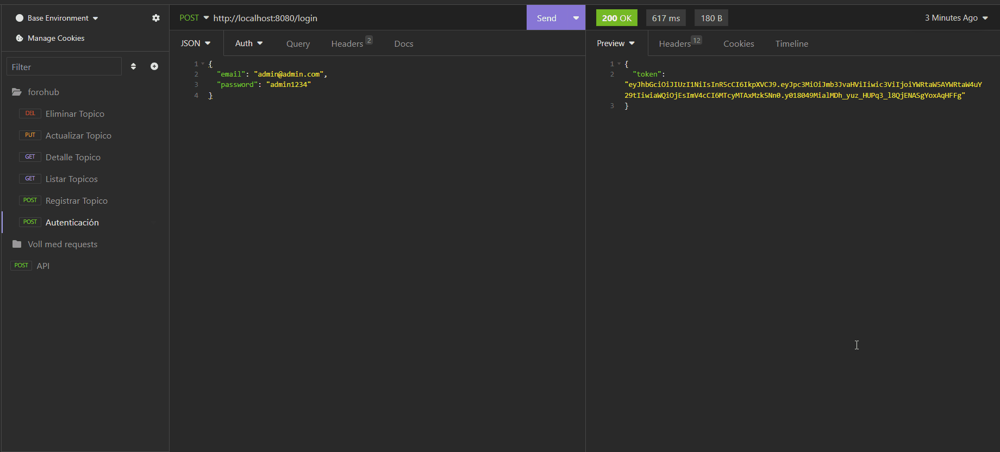

<header style="display: flex; flex-direction: column; justify-content: center; align-items: center">
<h1 align="center">ForoHub</h1>

</header>
<main>
<ul style="display:flex; flex-direction: column; gap: .5rem; list-style: none; padding: 0; margin-top: 50px">
<li>
<a href="#description" style="display: inline; align-items: center; gap: .5rem; text-decoration: none">
👍 
Descripción del proyecto
</a>
</li>
<li>
<a href="#state" style="display: inline; align-items: center; gap: .5rem; text-decoration: none">
👍 
Estado del proyecto
</a>
</li>
<li>
<a href="#functions" style="display: inline; align-items: center; gap: .5rem; text-decoration: none">
👍 
Demostración de funciones
</a>
</li>
<li>
<a href="#projects" style="display: inline; align-items: center; gap: .5rem; text-decoration: none">
👍 
Acceso al proyecto
</a>
</li>
<li>
<a href="#technologies" style="display: inline; align-items: center; gap: .5rem; text-decoration: none">
👍 
Tecnologías utilizadas
</a>
</li>
<li>
<a href="#author" style="display: inline; align-items: center; gap: .5rem; text-decoration: none">
👍 
Autor del proyecto
</a>
</li>
</ul>
<section id="description">
<h2>🚀 Descripción del proyecto</h2>

ForoHub es un Challenge propuesto por AluraLatam, es un espacio donde todos los participantes de una plataforma pueden plantear sus preguntas sobre determinados tópicos. Nuestra API se centrará específicamente en los tópicos, y permite a los usuarios: crear un nuevo topico, mostrar todos los topicos creados, mostrar un topico en específico, actualizar un topico y eliminar un topico.

</section>
<section id="state">
<h2>✔️ Estado del proyecto</h2>
<h4 align="center">
:checkered_flag: Proyecto finalizado :checkered_flag:
</h4>
</section>
<section id="functions">
<h2>🔨 Demostración de funciones</h2>
<ol>
<li>Api restringida.</li>

POST /login - Solo los usuarios autenticados pueden interactuar con la API. Para acceder el usuario debe enviar su (email, password). Todas las rutas de la API están protegidas, en cada solicitud deben enviar un token.

<li>Crear un nuevo topico</li>

POST /topicos - Si el titulo y mensaje del topico ya existen en la base de datos no se creara el topico, caso contrario crea un nuevo topico. Para crear un nuevo topico el usario debe enviar (title, message, course)

<li>Listar todos los topicos</li>

GET /topicos - Realiza una consulta y muestra todos los topicos registrados en la base de datos. La API retornara como respuesta por cada topico (id, title, message, creationDate, status, author, course)

<li>Listar topico por ID</li>

GET /topicos/id - La API realiza una consulta por ID y retorna como respuesta (title, message, creationDate, status, author).

<li>Actualizar topico por ID</li>

PUT /topicos/id - Actualiza topico por ID, valida si el title y message ya existen en la base de datos.

<li>Eliminar topico por ID</li>

DELETE /topicos/id - Elimina el topico por ID, 

</ol>

</section>
<section id="projects">
<h2>📁 Acceso al proyecto</h2>

Puedes acceder al proyecto siguiendo los pasos:

<ul>
<li>Clona el repositorio con git clone https://github.com/KonectaPe/ForoHub.git</li>
<li>Descarga, instala y configura MySQL.</li>
<li>Añade las configuraciones en el archivo properties, url de la base de datos, nombre de la base de datos, usuario y contraseña.</li>
<li>Listo eso es todo, ahora ejecuta el proyecto y verás la magia.</li>
</ul>
</section>
<section id="technologies">
<h2>✌️ Tecnologías utilizadas</h2>

Las tecnologías utilizadas en el proyecto:

<ul>
<li>Java</li>
<li>Spring Web</li>
<li>Spring Boot DevTools</li>
<li>Spring Data JPA</li>
<li>FlyWay Migration</li>
<li>MySQL Driver</li>
<li>Validation</li>
<li>Spring Security</li>
<li>JWT</li>
</ul>
</section>
<section id="author">
<h2>🧔 Autor del proyecto</h2>
<h3 style="padding: 0; margin: 0">

</h3>
<a href="https://github.com/KonectaPe/KonectaPe" target="_blank">
Deyver JM
</a>

Este proyecto esta bajo la Licencia MIT. Consulta LICENSE MIT para más detalles.

</section>
</main>